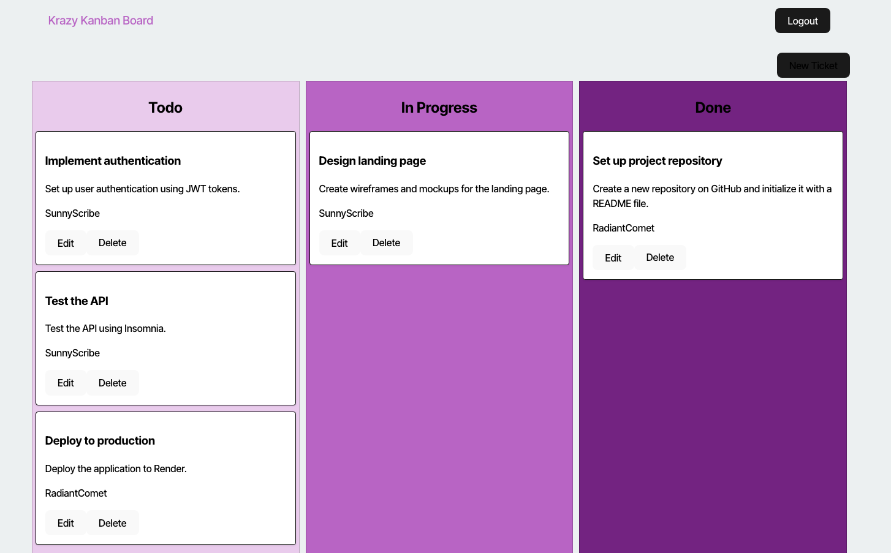

# kanban-board

## Table of Contents
- [Description](#description)
- [Installation](#installation)
- [Usage](#usage)
- [Contributing](#contributing)
- [License](#license)
- [Tests](#tests)
- [Questions](#questions)

## Description
A Kanban Board with user login via JWT Tokens. Made in React.

## Installation
Download the code from Github onto your local machine

## Usage
Once downloaded, open a terminal in the folder. Run 'npm install', then run 'npm run build'. After you want to run 'npm run seed', then 'npm run start:dev'.

## Contributing
Submit any changes you'd like to see as a Pull Request via Github

## Tests
https://kanban-board-ty6a.onrender.com

## License

None

## Questions
If you have any questions, please feel free to reach out:

- GitHub: [lattecoding](https://github.com/lattecoding)
